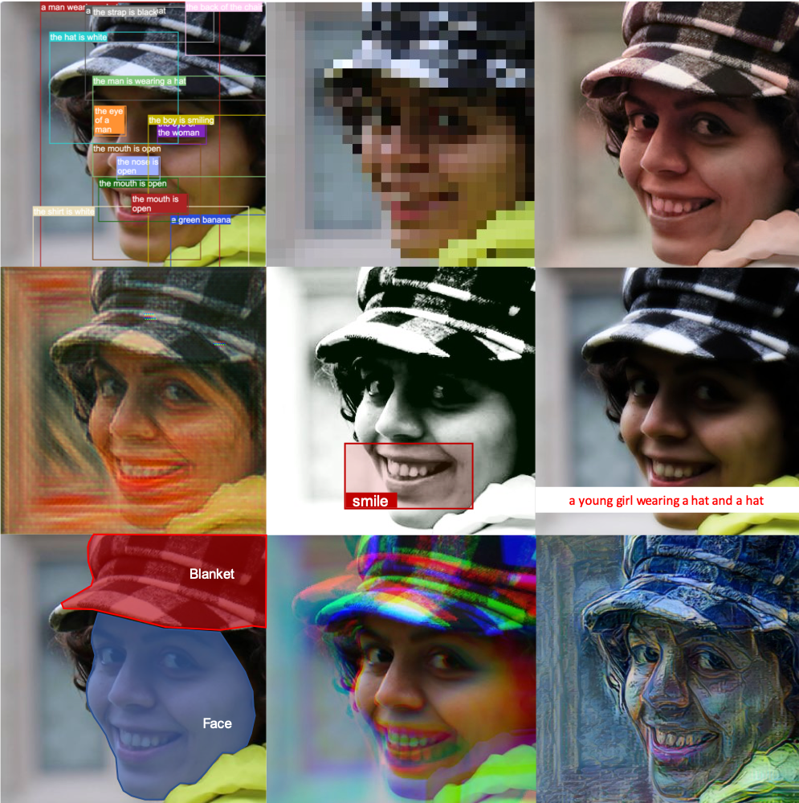

{:style="width: 360px; float: right; padding:15px"}

I am Samira!

I am currently a PhD candidate at [University of Amsterdam ](http://www.uva.nl/en). My field of research is Machine Learning and Cognitive Science.
I got into this field, because of two reasons: 1) I am super curious to understand how our brain works and what intelligence really means; 2) I feel passionate about building and developing smart tools and technologies to make our lives easier and happier.

At the moment, in the era of deep learning, I am very excited about working towards developing frameworks which can help detailed profiling of different kinds of neural network models, i.e., understand their learning dynamics and the factors that affect what they learn.

More generally, I like to work in the areas of science where we connect the dots between different theories in different fields.
In my blog here, I will be writing about the small steps I am taking, with the help of my collaborators and colleagues, towards these goals.

<!-- #### Projects I have supervised:

#### My publications:
 -->

<!-- ### On the other hand ... -->

<!-- I live in the beautiful city of Amsterdam! I always wanted to live in a place close to the sea where I can ride a bike! I just can't appreciate it enough that I ended up living in my dream land!

Besides what I do, I love math and physics! One of the categories of my most joyful moments in life is when I figure out how to solve a math problem. And every time I learn something new about how the universe works, it just blows my mind! -->
